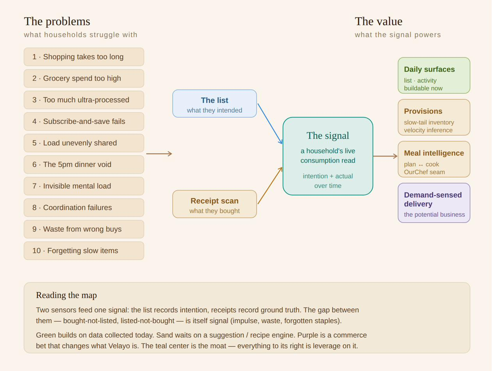

# The Consumption Signal
### How OurProvisions compounds into a defensible business

*Velayo, Inc. — Founder's strategy note*
*Author: Dan Holmes · Drafted July 2026*

---

## The one-sentence thesis

The durable asset OurProvisions builds is not a grocery list. It is a **living, high-resolution read of how a household actually consumes** — what it wants, what it buys, how fast it goes through things, and how that changes with the seasons of a life. Every feature we ship either *gathers* that signal or *spends* it. The list is the first sensor. It is not the moat. The signal is the moat, and the signal compounds.

Most grocery apps are tools you use and forget. Ours is designed so that the longer a household lives inside it, the more it knows — and the more it knows, the harder it is to leave and the more valuable it becomes to everyone in the chain, from the family to the retailer. That compounding is the whole business.

---

## Why this framing matters

It is easy to look at OurProvisions and see a well-made shared shopping list — collaborative, calm, nicely designed. That is true, and it is table stakes. Anyone can build a shared list. What they cannot easily build is *your household's accumulated history of consumption*, because that only exists after months of real use and cannot be bought, scraped, or copied.

This reframing changes how we prioritize. The instinct is to chase the exciting surfaces — meal planning, delivery, gamified savings. But the highest-leverage work is often the least glamorous: the quiet infrastructure that *learns how a household consumes*. That learning is the foundation every exciting feature stands on. Build it well, and the rest becomes possible. Skip it, and the rest is facade.

---

## The map

Read left to right. Ten real household problems feed two sensors. The two sensors feed one signal. The signal powers a tiered set of capabilities — some buildable on data we already collect, some waiting on engines still to be built, one that would change the shape of the company itself.

---

## The problems we solve

These are not invented. They are the daily frictions that quietly steal a household's time, energy, and peace — the frictions Velayo exists to remove.

1. **Shopping takes too long.** The trip itself is slow and disorganized.
2. **Grocery spend is too high.** Impulse friction is low; it is too easy to overspend.
3. **Too many ultra-processed foods.** The path of least resistance is the unhealthy one.
4. **Subscribe-and-save doesn't work.** Fixed calendar intervals can't track variable consumption — you end up with too much or too little.
5. **The load is unevenly shared.** One person carries the planning and the shopping.
6. **The 5pm dinner void.** Staring into a full fridge with no idea what to make.
7. **Invisible mental load.** One person holds the household's entire "what we need" model in their head. Exhausting, even when the work is shared.
8. **Coordination failures.** Duplicate buys, forgotten items, no shared awareness of a shared list.
9. **Waste from buying wrong.** Food bought and never used — money and food in the bin.
10. **Forgetting the slow-moving things.** You never forget milk. You forget baking soda, batteries, the thing you use once a month.

Every one of these is solved not by a feature in isolation, but by *spending the consumption signal* in the right place.

---

## The two sensors

The signal is built from two fundamentally different readings, and the difference between them is where much of the value lives.

**The list is intention.** It records what the household *wanted* — what someone thought to add. It is the sensor we already own and operate today, in real time, collaboratively.

**The receipt is ground truth.** It records what the household *actually bought* — real items, real prices, real quantities, real store, real total. Receipts are not a Phase 3 convenience feature. They are the purchase-history substrate: the event stream every intelligent feature downstream infers over.

The reason we need both is that **the gap between them is itself signal.** Items bought but never listed are *impulse buys* — the engine behind overspending (#2) and ultra-processed creep (#3). Items listed but never bought are *forgotten needs*. You cannot detect an impulse buy from a list alone, because by definition it was never on the list. Only the receipt reveals it. Two sensors, and the space between them is a third source of insight neither produces alone.

---

## What the signal powers — and when

The capabilities on the right of the map are deliberately tiered by how far they sit from data we collect today. This tiering *is* the roadmap.

**Buildable on today's data (nearest, safest ground).**
The collaborative list is live. An activity home — making the household's shared activity visible — reads data we already store (who added what, who shopped, when). These surfaces solve coordination (#8), mental load (#7), and shopping speed (#1) now, with no new capability required.

**Provisions — the slow-moving tail.**
Here is a principle most pantry apps get catastrophically wrong: they try to track everything, and die, because counting fast-moving staples is a full-time job no household will do. We invert it. *The faster an item moves, the less worth tracking it is; the slower it moves, the more valuable tracking becomes.* You don't need help remembering milk. You need help remembering the baking supplies and household goods that move slowly and get forgotten (#10). Velocity is **inferred from list and receipt history**, not entered by hand — the tracking is a byproduct of normal use, not a chore. Low cost to build, low cost to maintain, and it dodges the tedium that kills the category.

**Meal intelligence — the bidirectional link.**
Meals and groceries are the same data seen from two directions. Plan meals and the ingredients flow to the list (solves the dinner void, #6, and uneven load, #5). Or, in reverse: "here's what we have — what can we make?" The reverse direction is the more valuable and more distant one; it is the seam where a future recipe capability (OurChef, in the fleet) meets the grocery signal. Designing the meal↔item link now means the two apps have a clean joint later instead of a retrofit.

> **The loop of care.** Recipe provenance isn't just attribution — it's the seed of a relationship that can close a loop. When a recipe is passed from someone outside the household (a parent, a friend) to a member of it, and that member later shops for it and cooks it, there is a real, human moment available: the giver seeing their knowledge being used and loved. This is not an OurChef content feature (who wrote the recipe) — it's a Harbour-scale question, because the giver typically isn't a member of the household that's cooking. It requires some lightweight cross-household identity to answer well, which is exactly what Harbour is for and exactly why we're not building it yet. Preserved here so the idea survives design cycles until Harbour exists: recipe provenance should eventually support both a *passive* signal (the giver can look, if they choose to check) and a more ambitious *active* one (the giver is notified their recipe is being made). The active version is the more beautiful product but a materially bigger commitment — it's the difference between "recipe sharing" and "closing the loop of care," and it deserves to be evaluated as its own value proposition when Harbour design work begins.

**Demand-sensed delivery — the potential business.**
This is the one that is bigger than a feature. Subscribe-and-save fails (#4) because it schedules on a fixed calendar when real consumption is variable and event-driven. OurProvisions has something a calendar scheduler structurally cannot: **a live signal of actual consumption**, including its irregularity — the household that hosts six people every summer, the week everyone's traveling. That is a demand-sensing layer neither the retailer nor the scheduler possesses. It is valuable to the consumer (right amount, right time, no thought) *and* to the retailer (better forecasting, less churn). That two-sided value is not a checkbox. It may be a reason the company exists.

---

## An honest note on the delivery bet

The delivery layer is the most exciting box on the map and the one that most deserves caution.

It is a Phase 5+ capability wearing a Phase 1 conversation. Everything upstream — velocity learning, provisions inference, event-aware consumption — has to work first. Chasing it early means building a fragile integration on data we're not yet collecting well.

More importantly, **it changes what Velayo is.** Today we are "small, beautiful apps that remove daily frictions." A demand-sensed delivery business — with retailer relationships, fulfillment, two-sided marketplace dynamics — is a commerce and logistics company. That may be a magnificent evolution. It may also pull us away from the calm, human thesis into something operationally heavy. The right move is to decide that consciously, when the signal is strong enough to make it real — not to drift into it because one feature was exciting on a good night.

What this does tell us, unambiguously, is that **getting the boring data layer right now is the most strategically important thing we can do.** The consumption signal is the foundation two futures stand on: a genuinely helpful inventory experience, and a potentially large delivery business. Both are downstream of learning how a household consumes. That learning is the work.

---

## How the value evolves

For anyone evaluating the business, the shape of the value curve is the point:

- **Today:** a well-made collaborative list. Table stakes, but the sensor is live and gathering.
- **As history accumulates:** the signal sharpens. Velocity becomes real, provisions become useful, the app starts to *know* the household. Switching cost rises — not through lock-in tricks, but because the app is genuinely more useful the longer you've used it.
- **As engines land:** meal intelligence and receipt grounding turn the signal from a read into a set of recommendations and actions the household values.
- **At maturity:** the consumption signal becomes an asset with two-sided value — to families who get frictionless provisioning, and potentially to retailers who get demand insight no one else has.

The asset compounds with use, cannot be bought, and gets more valuable the longer a household stays. That is the definition of a moat, and it is why OurProvisions is a business and not just an app.

---

*This is a living strategy note. The thesis is firm; the delivery direction is deliberately held as a conscious future decision, not a commitment. Truth is a query against the correct environment, never the doc — and the same holds here: the map points the way, but the signal itself, once we're gathering it, is the thing to trust.*
